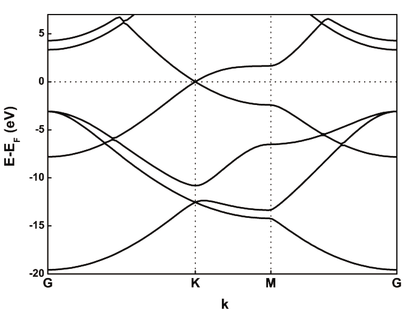
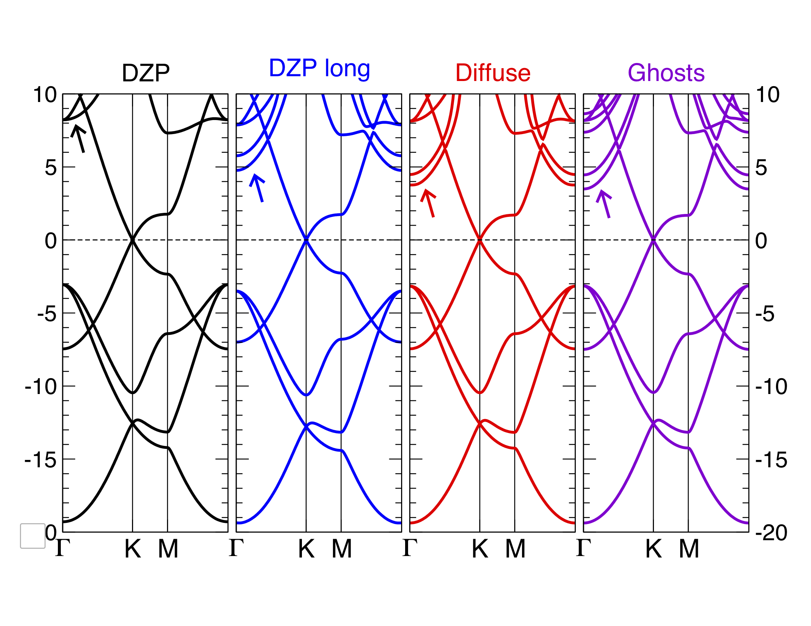

:sequential_nav: next

..  _tutorial-basic-basis-sets:

Basis sets
**********

..  sidebar:: **Have you set up the local environment?**

    If not, :ref:`do that now <local_installation>` before proceeding.

In this exercise we will look more closely at the basis sets used in
Siesta.

.. note::
   The required background consists of the talks by Emilio Artacho on
   the subject in the 2021 Siesta School:

Generalities
============

Pre-packaged basis sets
-----------------------

This is actually a very useful feature: if you have already generated (by
whatever means) a basis set that complies with the requirements of
Siesta (i.e., each orbital is the product of a strictly localized
radial function and a spherical harmonic), you can tabulate the radial
part and package it into a ``.ion`` file of the kind produced by
Siesta. Then, you just need to use the option::

   user-basis T

to have the program read the basis set, skipping any other internal
generation step. Actually, the ``.ion`` file contains also
pseudopotential information (via Kleinman-Bylander projectors and the
neutral-atom potential) which should be consistent with the
orbitals.

Note that there must be `.ion` files for all the species in the
calculation. If you have them, there is no need for pseudopotential
files either.  (Except for DFT+U calculations, which need to generate
their 'projectors' using the pseudopotential file)

The content of `.ion` files can be visualized with the tools mentioned
in :ref:`this how-to<how-to-orbital-visualization>`.

.. You can try these ideas in the `with-ion-files` directory.

Overview of basis-set generation options
----------------------------------------

Simple options
..............

Siesta offers many options for the specification of the basis set. 
Two of the key concepts are the cardinality of the set
and range of the orbitals, which can be specified, in most cases,
simply with a couple of lines. For example::

  PAO.basis-size DZP
  PAO.energy-shift 0.01 Ry

(Recall that the energy-shift is a physical concept determining the
increase in energy brought about by the confinement of the orbital, as
explained in the lecture.). There are one-line options like these
covering parameters such as the split-norm fraction, the
soft-confinement potential, etc. 

One can get quite far in the process of basis selection for a given
problem with one-line options like the above.  See directory ``water-simple``
for an example on water to explore.

The PAO.Basis block
...................

When we specify an option such as `DZP` for the cardinality of the
basis set, Siesta uses internal heuristics to decide which orbitals
are actually needed, which ones to treat as 'polarization orbitals',
etc. For this, it uses information about the ground-state of the
element involved (stored in tables in the program code) and about the
core/valence split of the pseudopotential. Most of the time, the
heuristics work very well, but in certain cases one might need fuller
control over the specification of the orbitals. Also, sometimes it is
needed to set different values of certain parameters for different
species in the calculation. All this can be done through the
``PAO.basis`` block.  For example, the block::
 
  %block PAO.Basis       
  O     2
  n=2    0    2  S 0.15
    0.0  0.0
    1.0  1.0
  n=2    1    3  S 0.18  P 1
    0.0   0.0   0.0
    1.0   1.0   1.0
  H     1      
  n=1    0    2  S 0.25  P 1
    0.0   0.0
    1.0   1.0
  %endblock PAO.Basis

says that `O` should have a 'double zeta' 2s shell, a  'triple zeta'
2p shell, and that the latter should be polarized by an extra
shell. The block specifies also the 'split-norm' parameters to be used
on a shell-by-shell basis.
For `H`, there is a double-zeta 1s shell, polarized, and a requested
value for the split norm. Note that the radii of the orbitals are set
to zero. This means that the program will use any other information
(in this case the split-norm values) to determine them.

The ``PAO.basis`` block can contain a very large number of
options. These are explained in the manual.

In what follows we present just a few examples of uses of the
PAO.Basis blocks for cases of interest.

Ghost orbitals
--------------

Siesta can place basis orbitals anywhere, not just in the position of
atoms. This is useful in certain cases. For example, in the treatment
of surfaces it is sometimes necessary to provide increased variational
freedom to the near-vacuum region, beyond the range of a typical
orbital. In this case one can define an extra layer of 'ghost atoms'
just outside the slab, carrying orbitals. We will see this in action
in the section on :ref:`basis set issues for 2D materials<basis-sets-2D-materials>`.

Another example is the treatment of certain defect systems, such as
vacancies.

Basis optimization
------------------

The Siesta distribution contains the directory `Util/Optimizer` with
code and examples of a framework that can be used in particular to
optimize basis sets. A full treatment is beyond the scope of this
simple tutorial, but the framework can be easily obtained and set up.

Case studies
============

Basis sets for molecules
------------------------

.. hint::
   Enter the directory *h2o*

This exercise is based on the H2O molecule. You will first use standard
basis sets generated by SIESTA, and then a basis set specifically
optimized for the H2O molecule. The ‘tips’ at
the end of this text will help you in analyzing the results of the
calculations.

Standard basis sets
...................

You will find three directories: SZ, DZ and DZP, in which you will
find input files for a H2O molecule, which will be solved with three
different basis sets: single-Z, double-Z and double-Z plus
polarizarion, respectively. The runs will consist in structural
relaxations via Conjugate gradients, to find the equilibrium structure
of the molecule for each of the bases used.

The bases are defined through lines like these::

  PAO.BasisSize DZP 
  PAO.EnergyShift 500.0 meV 
  PAO.Splitnorm 0.15

where the first one defines the number of orbitals in the basis set
(in this case, a double-Z plus polarization, which means two shells of
s orbitals, two shells of p orbitals, and a polarization shell of d
orbitals for oxygen, and two shells of s orbitals and one shell of
polarization p orbitals for H); the second line indicates the energy
shift parameter, that determines the cutoff radius of each of the
orbitals; and the third one is the Split norm parameter, which defines
the radius of the second-Z orbital in the case of double-Z bases.

You should do runs for each of the basis sets, changing the
``PAO.EnergyShift`` parameter, and look at the results as a function of
basis size and localization radius (or energy shift).  In particular,
you should look at:

* Total energy 
* Bond lenghts at the relaxed structure 
* Bond angles at the relaxed structure 
* CPU time 
* Radius of each of the orbitals 
* Shape of the orbitals

You have some files with results that you should be able to reproduce
in the *Out* directories.

Try to answer these questions:

* What is the best basis set that you have found? Why?

* How do the results compare with experiment?
  
* What do you consider a reasonable
  basis for the molecule, if you need an accuracy in the geometry of
  about 1%??

* In order to assess convergence with respect to basis set
  size, should you compare the results with the experimental ones, or
  with those of a converged basis set calculation?

.. note::
   One should note that H2O is a polar molecule. Since we are using
   periodic boundary conditions, there is an extra non-negligible
   interaction with the periodic images that distorts the molecule.
   See the mention in the 'first-encounter' tutorial.

Optimized basis sets
....................

You will now do the same calculations, but now using a
basis set specifically optimized for the H2O molecule. You can find
the files in directory *DZP-opt*.

Read the block which defines the basis set. Compare the parameters
with those of the calculations in Part 1.

Do the runs with this basis set, and compare the results with the
previous ones.

 Tips:

* Tip 1.: To find the bond lenghts, you can look in the files with 
  extensions .BONDS or .BONDS_FINAL.

..  The bond lengths and bond angles, could also be found with the
    Molekel program.  Load the h2o.ANI file (which contains the
    coordinates of the molecule during the relaxation), and use the
    'Geometry' option (left button of the mouse) to measure bond
    lengths and angles.

* Tip 2.: You can see the radii of the orbitals in the output file,
  just after the line reading: ``printput: Basis input``

* Tip 3.: You can look at the shape of the orbitals by plotting the
  contents of the .ion files produced by Siesta, as explained :ref:`in
  this how-to<how-to-orbital-visualization>`.

Basis sets for crystals
-----------------------

In the bulk, the convergence with respect to basis set range is much
faster than in molecules, since the basis does not need to reproduce
the exponential decay into vacuum.

.. hint::
   Enter the *si* directory

We will illustrate this with a the very simple case of bulk Si, in
order not to worry too much about other things like k-point sampling.

Start by editing the *si.fdf* file to select the cardinality of the
basis set (SZ, DZ, SZP, DZP, etc) and check the results for the total
energy.

Now, focus on the *range* of the orbitals by changing the
``PAO.energy-shift`` parameter. You will find that the energy
is lowest for a particular value of that parameter, and that further
increase in the orbital range actually increases the energy.

You can also experiment by changing the range of the orbitals shell by
shell, using the *PAO.Basis* block.

.. _basis-sets-2D-materials:

Basis sets for 2D materials
---------------------------

This exercise is intended to illustrate the optimization of the range
of the basis set orbitals for a slab system (in the limit of ultrathin slabs, 
such as monolayers). As you have seen in other examples, in the bulk, 
the convergence with respect to basis set range is much faster than in
molecules, since the basis does not need to reproduce the exponential
decay into vacuum. 2D systems represent an intermediate scenario, where 
the vacuum must be properly described in one direction (perpendicular to the plane).

We will check these effect using graphene (the prototypical 2D system), 
but simular effects are important for other layered materials, and even 
for surfaces [see for example S. Garcia-Gil et al Phys. Rev. B 79, 075441 (2009)].

.. hint::
   Enter the *graphene* directory
   
1. First, check the automatic basis generation, using SZ, SZP, DZ, DZP, TZ and TZP orbitals. 
The input file *graphene.auto.fdf* contains the required information. Compare the 
bandstructures, the total energy and the computational time for each basis.  You can search
for the time spent in the first SCF step::

    $ grep IterSCF  graphene.out

    timer: Routine,Calls,Time,% = IterSCF        1       0.151  40.55

The second to last column is the time in seconds. In this way, the computing time can also
be considered in the decision of which basis is more appropriate for
your study.

.. hint::
   To plot band structures you can use the following recipe. Let's
   assume that you are trying a *SZ* basis set. After you run the
   program, type::
     
     gnubands -G -F -o SZ -E 10 -e -20 graphene.bands
     gnuplot --persist -e "set grid" SZ.gplot
     
   The first line will create the SZ.gplot (plot script) and SZ (data)
   files. The second line will plot the band-structure. The label *SZ*
   is arbitrary, but if you choose it wisely for each case you try you
   will have easy access to the data later on.

2. Once we have a good basis (let's assume that DZP satisfies our
expectations), we proceed to optimize the cutoff radii (file
*graphene.fdf*).  Exploring the effect of the
`PAO.EnergyShift`` would show that the optimal value (in the sense of
lowest energy) is around 100 meV. However, inspection of the
bandstructure reveals that the :math:`\sigma^*` bands are not properly
described. These bands are ~8 eV above the Fermi level, while
plane-wave calculations give energies of 4-5 eV (see
:numref:`fig-sigma-star` as a reference).

.. _fig-sigma-star:

   Graphene band structure with VASP
   

You can improve the description of these states by increasing the
cutoff radii by hand in the ``PAO.Basis`` block in *graphene.fdf*.
However, even using orbitals with very long (and expensive) tails (up to 14 Bohrs),
the description of these bands is not accurate.

3. You can improve further the basis set using diffuse or ghosts orbitals. 
The file *graphene.diffuse.fdf* includes 3s and 3p orbitals with very long tails. 
These are enough to lower the energy of the :math:`\sigma^*` states below 5eV. 
Alternatively, the file *graphene.ghosts.fdf* includes a layer of ghost orbitals (C-like) 
slightly above and below the graphene plane. By doing this we are able to describe 
electronic states that extend farther away from the atomic layer into the vacuum, 
at the cost of including a significant number of orbitals in the
basis. You can compare your results with :numref:`fig-sigma-star-multi`.

.. _fig-sigma-star-multi:

   Graphene bands with Siesta with various basis sets
   

You can try different types of basis also for the ghost orbitals and check the results.
The file *GC.psf* is a copy of *C.psf*, and is used to generate the basis of the ghost atom, 
which must be defined in the ``ChemicalSpecies`` block (with a
negative Z; see the manual for details). You can use other type
of chemical species to define the ghosts.

  

   

   
