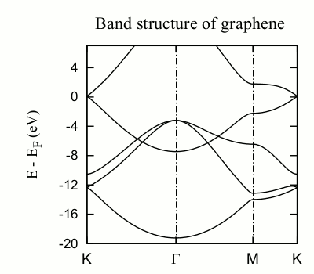
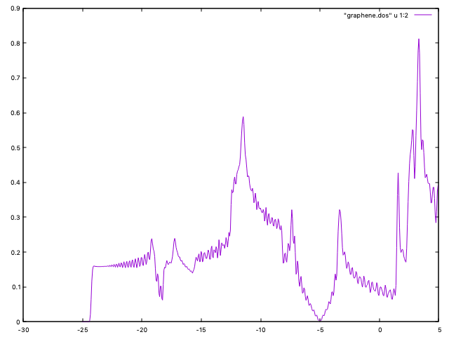
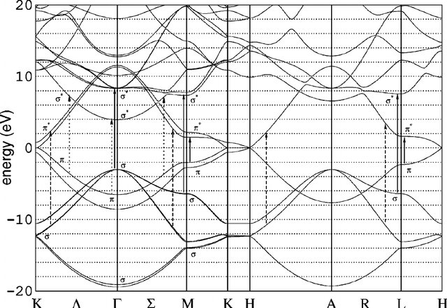

:sequential_nav: next

..  _tutorial-basic-kpoint-convergence:

Sampling of the BZ with k-points
================================

:Author: Miguel Pruneda (ICN2) and Alberto Garcia (ICMAB-CSIC).
	 
..  sidebar:: **Have you set up the local environment?**

    If not, :ref:`do that now <local_installation>` before proceeding.

In this exercise we will explore the convergence with k-point sampling 
for a (semi)metalic system, and compare with an insulator. We have selected
three carbon-structures that are particularly easy to converge in terms of 
basis and real-space mesh. You will work in the directories  *graphene*, *graphite*, 
and *diamond*. 

.. hint::
   Enter the *graphene* directory

Here we will focus on a well-known 2D crystalline system: graphene

In the input file *graphene.fdf* a 4x4x1 grid is used::

  %block kgrid_Monkhorst_Pack
  4  0  0    0.5
  0  4  0    0.5
  0  0  1    0.0
  %endblock kgrid_Monkhorst_Pack

As we will see, this is insufficient for a good description of
graphene.

To plot the DOS we will use the utility program 'Eig2DOS'. For the
broadening for each state in eV (a value of the order of the default
(0.2 eV) is usually reasonable, but if you want to reproduce the
smooth V-shape close to graphene´s Dirac cone you will probably have
to decrease that value). We can try::

   Eig2DOS -f -s 0.1 -n 400 -m -12.0 -M 2.0 -k graphene.KP  graphene.EIG > dos

which will compute the DOS in the (12 eV ,2 eV) range around the Fermi
level (``-f`` option), using a grid of 400 points and a broadening of
0.1 eV.

The content of the 'dos' file can be plotted using gnuplot::

   gnuplot
   plot "dos" u 1:4 with lines

We get a set of spikes, with just some inkling that there might be a
V-shaped feature near the Fermi level. Obviously the sampling is not
good enough.

The file graphene.fdf will also produce a file graphene.bands containing the
band structure along the several lines in the Brillouin zone (BZ) as
specified using the block::
  
 %block Bandlines
   1   0.5000000000   0.000000000   0.0000   M
  30   0.0000000000   0.000000000   0.0000   \Gamma
  45   0.3333333333   0.333333333   0.0000   K
  30   0.5000000000   0.500000000   0.0000   M
 %endblock BandLines

To plot the band structure we use the utility program
'gnubands', taking advantage of some new features (type ``gnubands
-h`` for a list of options)::

   gnubands -F -G -o bandstructure -E 10 -e -20 *.bands

that will shift the origin of energy to the Fermi level. With the
above command we will get a window between -20 eV and 10 eV with
respect to Ef. Also, a 'bandstructure.gplot' driver file is created
automatically (which has extra information to place and label the
'ticks' for each symmetry point in the BZ). Now we plot::

  gnuplot --persist -e "set grid" bandstructure.gplot

The position of the Dirac cone is highlighted by the
gridline passing by the high-symmetry K point). It is obvious,
however, by looking at the Ef gridline, that the Fermi
level does not fall exactly at the Dirac cone, as it should (see
:numref:`fig-graphene`).

.. _fig-graphene:

   Graphene band structure

The position of the Fermi level in (semi)metals is very sensitive to
the k-point mesh used. In this case, the 4x4x1 sampling originally set
in the input file is clearly not appropriate. You can increase the
Monkhorst-Pack parameters and check the convergence.  Notice also that
in graphene (and other hexagonal lattices) the K-point (1/3,1/3,0) is
particularly relevant, and it is advisable that it is explicitly
included in the discretization. In fact, in this case including the
K-point makes all the difference, as can be seen by using this block::

 %block kgrid_Monkhorst_Pack
  6  0  0    0.0
  0  6  0    0.0
  0  0  1    0.0
 %endblock kgrid_Monkhorst_Pack

The Fermi level is now exactly at the vertex of the Dirac cone. But
this is not really a consequence of having increased the density of
k-points, but of including the K-point in the sampling (check the
*graphene.KP* file, but note that the k-points are given in cartesian
coordinates, not relative to the reciprocal basis vectors; can you see
it?). In fact, if we use the block::

 %block kgrid_Monkhorst_Pack
  3  0  0    0.0
  0  3  0    0.0
  0  0  1    0.0
 %endblock kgrid_Monkhorst_Pack

leading to a much coarser sampling, we still get the Fermi level
correctly aligned. The presence of the K point in the sampling set pins
the Fermi level at the Dirac cone.

It is also instructive to see the behavior of the DOS when the k-point
sampling gets more dense. For coarse samplings, it does not look at
all like the "free-electron-like" curve we see in textbooks. This is
due to the very simple method used to construct the DOS (just
broadening a collection of discrete energy levels). You probably have
to increase the mesh beyond 60x60x1 to have good plots for the DOS.

.. note::
   You do not need to run again a full scf cycle to get the DOS
   with more k-points. You could re-use the converged density-matrix
   to shorten the cycle (option ``DM.use-save-dm``). There is an
   alternative route that does not use the .EIG file, but the
   computation of the partial density of states. Just include the
   blocks::

     %block ProjectedDensityOfStates
       EF -20.00  10.00  0.100  500  eV
     %endblock ProjectedDensityOfStates

     %block PDOS.kgrid_Monkhorst_Pack
      60  0  0    0.0
      0  60  0    0.0
      0   0  1    0.0
     %endblock PDOS.kgrid_Monkhorst_Pack

   and the program will compute the pDOS (and the DOS) in a finer
   grid. The DOS is in *graphene.DOS*, which can be plotted as::

      gnuplot> plot "graphene.DOS" u 1:2 with lines

   to get a figure similar to :numref:`fig-graphene-DOS`.
   (Note that the scf sampling was set to 6x6x1, as above). The
   pDOS information might be useful also.

.. _fig-graphene-DOS:

   Graphene DOS (60x60x1 k-sampling) 
    

.. hint::
   Enter the *graphite* directory

Graphite is the 3D version of graphene. It is a semimetal, and similar 
caveats than graphene apply.  Now, however, the k-point sampling along 
the three spatial directions must be considered.  

The input "graphite.fdf" includes the bandlines required to plot the
bands.  Notice that there is a flat band right at the Fermi level
(compare with :numref:`fig-graphite-bands`).
Check the convergence of the Fermi level, and the DOS as a function of
the k-sampling.

.. _fig-graphite-bands:

   Graphite bands

.. hint::
   Enter the *diamond* directory
   
Finally, another 3D example is diamond. It has the same fcc structure
as silicon, and the high-symmetry K points are included in the input
file "diamond.fdf". Unlike graphene and graphite, diamond is
non-metallic, and the k-point convergence is easier.  Plot bands, and
DOS and check the results.

   
  
  
   

   
