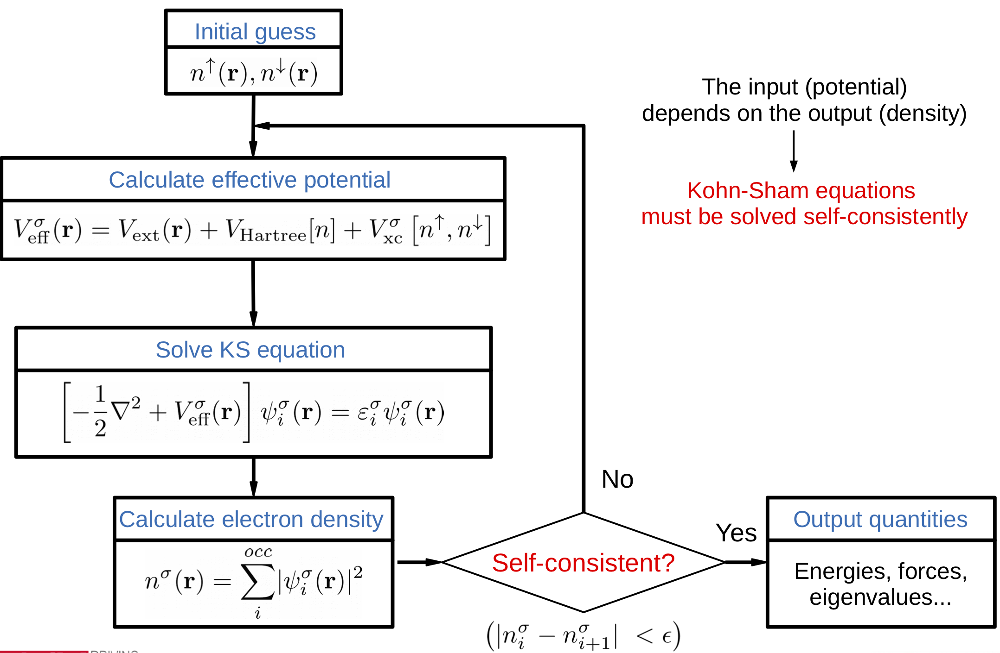

:sequential_nav: next

..  _tutorial-basic-scf-convergence:

The self-consistent-field cycle
===============================

..  sidebar:: **Have you set up the local environment?**

    If not, :ref:`do that now <local_installation>` before proceeding.

In this exercise we will look more closely at the scf cycle
(:numref:`fig-scf-cycle`) and how to monitor its convergence

.. _fig-scf-cycle:

   Flow diagram of the scf cycle
   

Whether a calculation reaches self-consistency in a moderate number of
steps depends strongly on the mixing strategy used. The available
mixing options should be carefully tested for a given calculation
type. This search for optimal parameters can repay itself handsomely
by potentially saving many self-consistency steps in production runs.

In this tutorial we will see a brief summary of the options related to
self-consistency, and will practice with them.

.. note::
   Here we use the modern forms of the options. You might find legacy
   options in fdf files. They are still valid but are
   deprecated. Consult the manual for more information.

Siesta can mix either the density matrix (DM) or
the hamiltonian (H), according to the flag::

  SCF.mix  { density | hamiltonian }

The default is to mix the Hamiltonian, which typically provides better results.

It can be illustrative to look at a sketch of the code flow to
understand the interplay between the DM and H, depending on the mixing options::

            if ( mixH ) then
             
             call compute_DM( iscf )
             call compute_max_diff(Dold, Dscf, dDmax)

             call setup_hamiltonian( iscf )
             call compute_max_diff(Hold, H, dHmax)
             
            else
             
             call setup_hamiltonian( iscf )
             call compute_max_diff(Hold, H, dHmax)
             
             call compute_DM( iscf )
             call compute_max_diff(Dold, Dscf, dDmax)
               
            end if

            (appropriate mixing here)
	    
.. note::
   Beyond the two main mixing methods, there are other
   experimental techniques that we will not discuss in this tutorial

There are two main ways in which the SCF condition can be  monitored
in SIESTA:

* By looking at the maximum absolute difference dDmax between the matrix elements of
  the new ("out") and old ("in") density matrices. The tolerance for
  this change is set by ``SCF.DM.Tolerance``. The default is 10-4, which is a
  rather good value, valid for most uses, except when high accuracy is
  needed in special settings (some phonon calculations, or simulations
  with spin-orbit interaction).
 
* By looking at the maximum absolute difference dHmax between the matrix elements of
  the hamiltonian.   The actual meaning of dHmax depends on
  whether DM or H mixing is in effect: if mixing the DM, dHmax refers
  to the change in H(in) with respect to the previous step; if mixing
  H, dHmax refers to H(out)-H(in) in the current step.
  The tolerance for  this change is set by ``SCF.H.Tolerance``. The default is 10-3 eV.

By default, *both* criteria are enabled and have to be satisfied for
the cycle to converge. To turn off any of them, one can use one of the
options::

  SCF.DM.Converge F
  SCF.H.Converge  F

The options to control the mixing are quite varied, and the manual
should be studied to gain a full understanding. Here we will cover the
more basic options.

The first is the method of mixing, controlled by SCF.Mixer.Method::

  scf-mixer-method { linear | Pulay  | Broyden }

with linear mixing being the default. In this case, the mixing 
is controlled by ``SCF.Mixer.Weight`` (formerly ``DM.MixingWeight``),
which is 0.25 by default. This means that the program keeps 70% of the
original DM or H, and adds to it 25% of the new one.

The Pulay and Broyden methods are more sophisticated: they keep a
history of previous DMs or Hs (as many as indicated by the
``SCF.Mixer.History`` flag, which defaults to 2.

A simple example
----------------

In directory CH4 there is a `ch4.fdf` file very similar to the one in
the first-contact tutorial, but with the mixing options modernized
(and a DZP basis set).

Run the example with the provided parameters. Yoy will see that the
program stops with an error regarding lack of scf convergence: it has
not reached convergence in the allowed 10 scf iterations (set by the
``MaX-scf-iterations`` parameter. Before trying anything else you
might want to increase the allowed number of iterations.

Play with the ``SCF.Mixer.Weight`` parameter to see if you can
accelerate the convergence. Also, check the differences when  mixing the DM or H.
 
You have probably noticed that using large values (close to 1),
reaching convergence becomes extremely difficult or even
impossible. However, if you use a large value, but now set the
parameter ``scf-mixer-method`` to `Pulay` or `Broyden`, you will
see that the SCF convergence is reached in a few
iterations. Experiment with the values of ``SCF.Mixer.History`` and
``SCF.Mixer.Weight`` to see if you can find optimum values
for a fast convergence.

 
A harder example
----------------

Directory ``Fe_cluster`` contains an example of a non-collinear spin
calculation for a simple linear cluster with three Fe atoms.

The input file `fe_cluster.fdf` is set up to use linear mixing with a
small mixing weight. Check how many iterations are needed for
convergence.

Now experiment with other options, and see how much you can reduce the
number of iterations.

When you are done, you might want to peruse the file `scfmix.fdf`, in
which the new mixing technology in Siesta is exemplified (use of
different strategies that can kick in under certain conditions,
defined in blocks). You need to read the manual to follow the
meaning of the options.

.. note::
   See that we have commented out the ``DM-use-save-dm``
   option. Otherwise, a new calculation in the same directory would
   re-use a (possibly converged, or half converged) DM file.

.. note::
   If you have a hard-to-converge system, you might want to share it
   with the developers.
   
  
  
   

   
